# Отчет — Лабораторная работа 1 «Свой Docker»

## Шаг 0. Настройка окружения

Начинаю с того, что ставлю на macOS Lima, для того чтобы можно было поднять Linux-виртуалку:

```
brew install lima
```

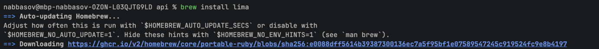

<details><summary><b>Информационная справка про Lima</b></summary>

Lima скачивает образ дистрибутива, создаёт VM, монтирует каталоги с Mac внутрь, пробрасывает порты и даёт шелл. По сути это «лёгкая Linux-машина под рукой», без VirtualBox и ручной установки ОС.
</details>

Затем создаю и запускаю VM с именем `lab`:

```
limactl start --name=lab template://ubuntu-lts
```

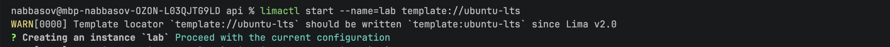

Открываю шелл внутри VM:

```
limactl shell lab
```

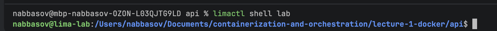

## Шаг 1. Запуск сервиса без изоляции

Настроил окружение теперь можно поесть(делать лабу)

### Сборка бинарника (на Mac)

Собираю Linux-бинарник кросс-компиляцией прямо на Mac:

```
cd ~/Documents/containerization-and-orchestration/lecture-1-docker/api
GOOS=linux GOARCH=arm64 go build -o api-linux .
```

<details><summary><b>Почему кросс-компиляция и почему arm64</b></summary>

`GOOS`/`GOARCH` говорят компилятору «собери под другую платформу» — Linux и arm64,
потому что VM на Apple Silicon наследует архитектуру процессора.
Маковский бинарник (Mach-O) в Linux не запустился бы.
</details>

### Запуск в VM

В VM (`limactl shell lab`) проверяю архитектуру, копирую бинарник в локальный каталог VM и запускаю сервис:

```
uname -m        # проверка: показало aarch64 — arm64 верный выбор
mkdir -p ~/lab
cp /Users/nabbasov/Documents/containerization-and-orchestration/lecture-1-docker/api/api-linux ~/lab/api
cd ~/lab
./api &
curl localhost:8080/health
ps aux | grep '[a]pi'
```

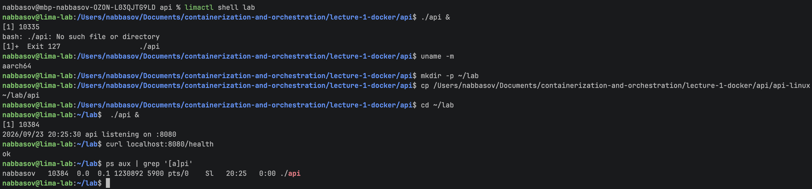

Запускаю бинарник `api` из текущего каталога,
а `&` в конце — это job control оболочки: процесс уходит в фон,
и шелл сразу возвращает приглашение,
не ждет завершения программы (а наш сервис сам не завершится никогда — он слушает порт).

### Результат запуска

```
nabbasov@lima-lab:~/lab$ ./api &
[1] 10384
2026/09/23 20:25:30 api listening on :8080
nabbasov@lima-lab:~/lab$ curl localhost:8080/health
ok
nabbasov@lima-lab:~/lab$ ps aux | grep '[a]pi'
nabbasov   10384  0.0  0.1 1230892 5900 pts/0    Sl   20:25   0:00 ./api
```

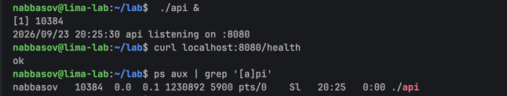

Сервис запустился с PID **10384**, `/health` отвечает `ok`. Что видно в строке `ps`:

- `USER = nabbasov` — процесс работает от обычного пользователя, не root;
- `RSS = 5900` (≈6 МБ) — реально занятая память; после `/eat` в Части 3 эта цифра будет расти;
- `pts/0` — процесс привязан к терминалу: закрою сессию — он завершится.

### Вывод шага

Сейчас `api` — обычный процесс без какой-либо изоляции. Он находится в тех же **корневых namespaces**,
что и все процессы VM,
поэтому видит все процессы системы, общую сеть и общий корень файловой системы.

Потолка по ресурсам у него нет: `/eat?mb=100000` вызвал бы **системный** OOM — ядро убило бы процесс по рейтингу 
среди всех процессов.
Контейнерные механизмы — namespaces, cgroups, урезание прав — это функции именно ядра Linux,
поэтому на Mac нужна Linux-VM: Docker Desktop прячет такую же внутри себя,
и `uname` в любом контейнере на Mac показывает Linux.
## Шаг 2. namespaces

### Препятствие: Ubuntu ограничивает user namespaces

Первая же попытка `unshare` упёрлась в ошибку:

```
nabbasov@lima-lab:~/lab$ unshare --user --map-root-user --pid --fork \
    --mount --mount-proc --net --uts --ipc bash
unshare: write failed /proc/self/uid_map: Operation not permitted
```

Причина — Ubuntu 24.04 по умолчанию запрещает обычным пользователям создавать user namespaces
(ограничение через AppArmor): userns — не только механизм защиты,
но и лишняя поверхность атаки на ядро. Для лабы снимаю ограничение (до перезагрузки VM):

```
sysctl kernel.apparmor_restrict_unprivileged_userns   # было = 1
sudo sysctl -w kernel.apparmor_restrict_unprivileged_userns=0
```

### Создание namespaces

```
unshare --user --map-root-user \
        --pid --fork --mount --mount-proc \
        --net --uts --ipc \
        bash
```

<details><summary><b>Что даёт каждый флаг</b></summary>

- `--user --map-root-user` — новый user namespace, мой uid отображается в root внутри (поэтому команда работает без sudo);
- `--pid --fork` — новый pid namespace; `--fork` нужен, потому что сам `unshare` уже существует и в новую нумерацию не попадёт — PID 1 становится его потомок (`bash`);
- `--mount --mount-proc` — новый mount namespace и свежий `/proc` в нём (иначе `ps` показывал бы процессы хоста);
- `--net` — новый пустой сетевой стек;
- `--uts` — своё имя хоста;
- `--ipc` — своя разделяемая память и очереди сообщений.
</details>

Приглашение сменилось на `root@lima-lab`

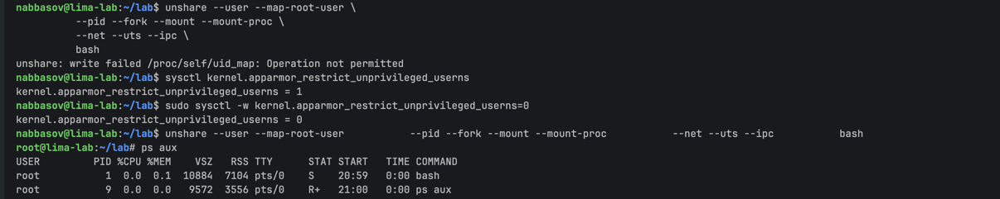

### Взгляд изнутри

```
root@lima-lab:~/lab# ps aux
USER         PID %CPU %MEM    VSZ   RSS TTY      STAT START   TIME COMMAND
root           1  0.0  0.1  10884  7104 pts/0    S    20:59   0:00 bash
root           9  0.0  0.0   9572  3556 pts/0    R+   21:00   0:00 ps aux

root@lima-lab:~/lab# hostname mycontainer && hostname
mycontainer

root@lima-lab:~/lab# ip a
1: lo: <LOOPBACK> mtu 65536 qdisc noop state DOWN group default qlen 1000

root@lima-lab:~/lab# id
uid=0(root) gid=0(root) groups=0(root),65534(nogroup)
```

Что показал каждый namespace:

- **pid** — во всей «системе» два процесса, `bash` — **PID 1**; свежий `/proc` дал `--mount-proc` (**mnt**);
- **uts** — имя хоста сменилось на `mycontainer`, хост этого не видит;
- **net** — сеть девственно пуста: только loopback, и тот `DOWN`;
- **user** — `id` говорит `root`, хотя запускал всё обычный пользователь.

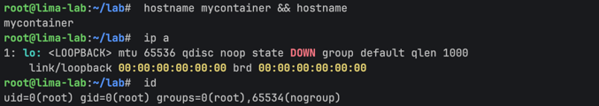

### Запуск api внутри

```
root@lima-lab:~/lab# ./api &
[1] 14
2026/09/23 21:01:27 api listening on :8080
root@lima-lab:~/lab# curl localhost:8080/health
curl: (7) Failed to connect to localhost port 8080 after 0 ms: Could not connect to server
```

Сервис запустился (PID **14** — своя нумерация!),
но `curl` изнутри не достучался,
т к видна в `ip a` выше: новый net namespace настолько пуст,
что даже loopback в нём **выключен** — на хосте его поднимает система при загрузке,
в Docker это молча делает рантайм. А `listen :8080` («на всех интерфейсах») ядро разрешает и при лежачей сети — слушать можно,
дойти до слушателя нельзя. Поднимаю loopback сам:

```
root@lima-lab:~/lab# ip link set lo up
root@lima-lab:~/lab# curl localhost:8080/health
ok
```

интересные факты когда делал лабу:
внутри порт 8080 занят (второй `./api` упал с `bind: address already in use`),
но с хостовым `api` (PID 10384), слушающим тот же `:8080`, конфликта нет — два процесса, один порт, разные net namespaces.

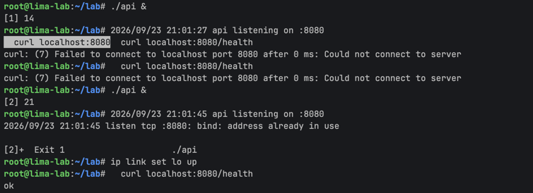

### Номера namespaces изнутри

```
root@lima-lab:~/lab# ls -l /proc/1/ns/
ipc  -> ipc:[4026532481]     mnt  -> mnt:[4026532479]
net  -> net:[4026532483]     pid  -> pid:[4026532482]
user -> user:[4026532347]    uts  -> uts:[4026532480]
cgroup -> cgroup:[4026531835]   time -> time:[4026531834]
```

Шесть заказанных namespaces (`ipc`, `mnt`, `net`, `pid`, `user`, `uts`) — новые (`40265324xx`),
а `cgroup` и `time` остались хостовыми: изоляция — не «всё или ничего», а по одному namespace на выбор.

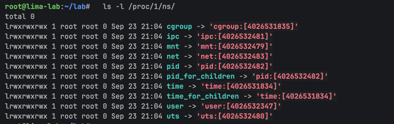

### Взгляд снаружи (Терминал 2)

```
nabbasov@lima-lab:...$ hostname
lima-lab

nabbasov@lima-lab:...$ ps aux | grep '[a]pi'
nabbasov   10384  0.0  0.1 1230892 5920 pts/0    Sl   20:25   0:00 ./api   ← хостовый (Часть 1)
nabbasov   10509  0.0  0.1 1230636 5724 pts/0    Sl   21:01   0:00 ./api   ← тот, что внутри ns

nabbasov@lima-lab:...$ ps aux | grep 'pts/0' | grep '[b]ash'
nabbasov   10488  ... unshare --user --map-root-user --pid --fork ... bash
nabbasov   10489  ... bash                                              ← PID 1 внутри ns

nabbasov@lima-lab:...$ sudo ss -tlnp | grep 8080
LISTEN 0 4096 *:8080 *:* users:(("api",pid=10384,fd=3))
```

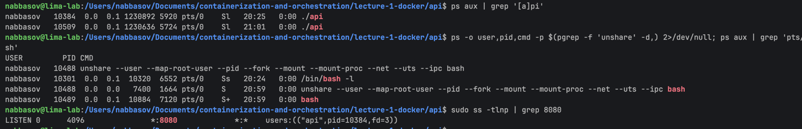

Изнутри api имеет PID 14, снаружи это PID 10509. Внутри `id` говорит root, а хост видит процесс под моим обычным пользователем nabbasov.
Hostname внутри я сменил на mycontainer,
но на хосте остался lima-lab. 
Порт 8080 внутри слушает внутренний api, 
 в `ss` на хосте виден только старый 10384 а внутренний для хоста просто не существует.
И номера namespaces тоже разные: шесть новых у процесса внутри, у хоста корневые.

Контрольный эксперимент: `kill 10384` на хосте — и хостовый `curl localhost:8080/health` не работает.
Порт «свободен», но в хостовом net namespace на нём никто не слушает, а до внутреннего слушателя из хоста нет пути.

### Вывод шага

По pid namespace: процесс попадает в namespace только при создании, поменять его потом нельзя.
Поэтому unshare делает fork, и PID 1 становится уже его потомок (bash),
а не сам unshare. у одного процесса два номера: внутри api это PID 14, а хост видит его как 10509.

По сети: я сначала думал, что раз порт занят хостовым api, внутренний не сможет слушать.
у каждого net namespace своя таблица портов, оба api спокойно слушали 8080 одновременно.
Проблема в другом: с хоста до внутреннего api просто нет пути,
у его сетевого стека нет ни интерфейсов, ни маршрутов.
Я проверил: убил хостовый api и curl с хоста вообще перестал работать, хотя порт свободен и внутри сервис жив.
В Docker эту проблему решает пара veth и мост, плюс проброс порта.

По user namespace: root внутри ненастоящий.
Внутри id показывает uid=0, но хост видит процесс под моим обычным пользователем nabbasov
. Если из такого контейнера сбежать, на хосте окажешься обычным пользователем без прав, а не root'ом.

Ещё узнал, почему Ubuntu по умолчанию запрещает создавать user namespaces обычным пользователям:
сам механизм защищает (root внутри фиктивный), 
но при этом даёт обычному пользователю доступ к частям ядра, куда раньше пускали только root, а там регулярно находят уязвимости.
Поэтому и стоит запрет через AppArmor, который я снимал в начале шага.

## Шаг 3. cgroups

### Память: ловлю OOM

Cgroup v2 — это дерево каталогов в /sys/fs/cgroup, настройки задаются записью в файлы.
Создаю группу lab, включаю контроллеры и ставлю потолок памяти 256М.
Swap группе отключаю, иначе вместо OOM процесс просто уполз бы в своп:

```
sudo mkdir /sys/fs/cgroup/lab
echo "+memory +cpu +pids" | sudo tee /sys/fs/cgroup/cgroup.subtree_control
echo 256M | sudo tee /sys/fs/cgroup/lab/memory.max
echo 0    | sudo tee /sys/fs/cgroup/lab/memory.swap.max
```

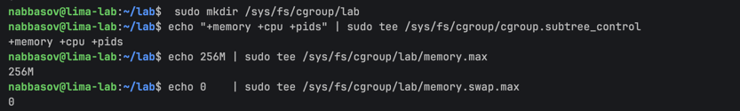

Запускаю api и вписываю его PID в группу:

```
./api &
echo 414795 | sudo tee /sys/fs/cgroup/lab/cgroup.procs
cat /proc/414795/cgroup     # 0::/lab — процесс в группе
```

Тут я в первый раз косякнул: запускал сервис командой `cd ~/lab && ./api &`, и шелл печатал PID не самого api,
а bash-обёртки вокруг всей цепочки. В cgroup я посадил обёртку,
а api гулял на свободе — memory.current так и оставался нулём, хотя сервис съел 100 МБ.
Нашёл по `ps aux`: там был другой PID, чем напечатал шелл.
Вывод: PID для cgroup сверять по ps, а не брать из `[N] NNNN`,
и запускать процесс простой командой без &&.
Ещё узнал,
что при переезде процесса в группу уже выделенная память остаётся числиться за старой группой,
а раньше рождённые потомки не переезжают вместе с родителем.

Дальше сам эксперимент:

```
curl 'localhost:8080/eat?mb=100'    # ate 100 MB — жив
cat /sys/fs/cgroup/lab/memory.current   # 106426368, примерно 101 МБ — учёт работает
curl 'localhost:8080/eat?mb=300'    # curl: (52) Empty reply from server
[3]+  Killed                     ./api
```

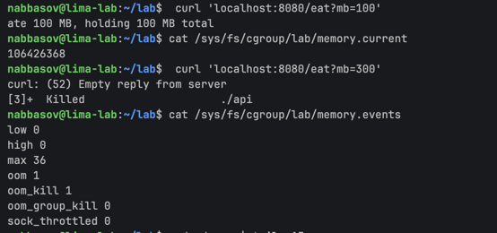

Просил 300 МБ при потолке 256 — api убило прямо посреди обработки запроса,
клиент получил обрыв соединения без ответа.
Так это и выглядит для клиентов в Kubernetes, когда под ловит OOMKilled под трафиком.

Что осталось в статистике группы:

```
cat /sys/fs/cgroup/lab/memory.events
max 36
oom 1
oom_kill 1
```

И некролог в dmesg:

```
oom-kill:constraint=CONSTRAINT_MEMCG,...,oom_memcg=/lab,task_memcg=/lab,task=api,pid=414795
Memory cgroup out of memory: Killed process 414795 (api) total-vm:1690788kB, anon-rss:262500kB, ...
```

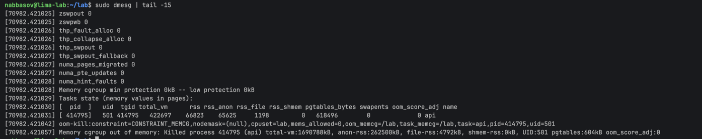

Что тут важно. CONSTRAINT_MEMCG значит, что жертву искали только внутри группы /lab — при системном OOM
было бы CONSTRAINT_NONE и мог убиться любой из VM.
anon-rss:262500kB — умер ровно на потолке 256М.
Убивает OOM сигналом SIGKILL (9): его нельзя перехватить.
Строка max 36 показывает, что до убийства ядро 36 раз упиралось в потолок и пыталось освободить память
группы без жертв(сбросить кэши или вытеснить в swap). Но у api память анонимная (данные в куче),
а swap я отключил, так что освобождать было нечего.

### CPU: throttling

С процессором все по другому: за перебор не убивают, а начинает тормозить(как я пока делал лабу).
Лимит задаётся двумя числами в cpu.max — квота и период в микросекундах.
Ставлю половину ядра: 50 мс работы на каждые 100 мс.

```
./api &
echo 414926 | sudo tee /sys/fs/cgroup/lab/cgroup.procs
echo "50000 100000" | sudo tee /sys/fs/cgroup/lab/cpu.max
curl localhost:8080/burn
```

/burn крутит бесконечный цикл на одном ядре,
то есть хочет 100 мс из каждых 100.
В top у api примерно 41-50% CPU — больше половины ядра ему не дают.
Интереснее статистика cpu.stat, снял её два раза с паузой:

```
nr_periods 251        nr_periods 426
nr_throttled 248      nr_throttled 423
throttled_usec 12487984   throttled_usec 21340591
```

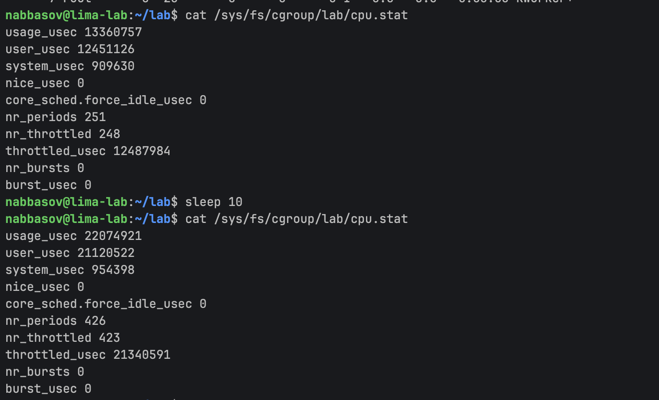

Между замерами прошло 175 периодов и все 175 задушены.
Внутри каждого периода происходит одно и то же:
burn выжигает квоту 50 мс без остатка, остаток периода группа стоит снятая с процессора,
с новым периодом квота выдаётся заново — и по кругу.
Посчитал по разнице throttled_usec: 8 852 607 мкс простоя за 175 периодов — это 50,6 мс на период,
ровно отнятая половина.

Главное отличие от OOM: процесс жив,
/health отвечает ok,
ошибок нигде нет — но каждую секунду он полсекунды стоит.
В проде такое выглядит как «тормозит без ошибок»,
и по графику %CPU это не видно
(там скромные 50%, кажется что запас есть — график показывает использованное, а не недоданное).
Диагностируется по nr_throttled и throttled_usec из cpu.stat.

Тут кто то задастся вопросом(хотя это очев) почему память нельзя наказывать так же, задержкой:
выделенные байты не отнимешь «на полпериода» — в них лежат данные,
вернуть их потом нельзя.
А процессорное время можно недодать сейчас и дать в следующем периоде.
Поэтому память бьёт завершением, процессор — задержкой.

### Процессы: форк-бомба против pids.max

Число процессов — тоже ресурс: таблица PID у ядра конечна. Возвращаю группе полный CPU (чтобы бомба горела в полную силу), смотрю текущее число задач и ставлю потолок:

```
echo "max 100000" | sudo tee /sys/fs/cgroup/lab/cpu.max
cat /sys/fs/cgroup/lab/pids.current    # 7 — «один api» это 7 потоков Go-рантайма, контроллер считает задачи
echo 30 | sudo tee /sys/fs/cgroup/lab/pids.max
```

Бомбу надо взрывать внутри группы, снаружи лимит не действует.
Запускаю новый bash, сажаю его в группу (переменная $$ — PID самого шелла) и поджигаю:

```
bash
echo $$ | sudo tee /sys/fs/cgroup/lab/cgroup.procs
stress-ng --fork 50 --timeout 15s
```

Пока бомба горела, во втором терминале смотрел на оборону:

```
cat /sys/fs/cgroup/lab/pids.current
30
cat /sys/fs/cgroup/lab/pids.events
max 251681
...
max 252110
```

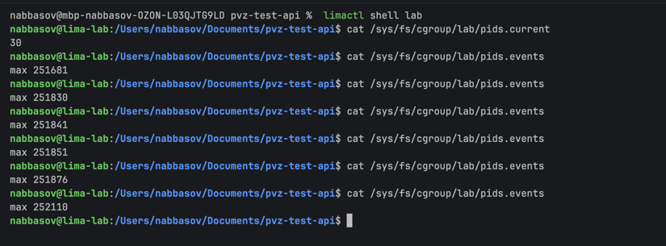

pids.current прибит ровно в потолок 30, а счётчик max в pids.events — это отбитые попытки:
каждый раз, когда бомба зовёт fork(), ядро отвечает ошибкой EAGAIN, и новый процесс просто не рождается.
За 15 секунд набежало больше 250 тысяч отказов — отказ дёшев, никого не надо убивать или тормозить,
поэтому бомба может долбиться сколько угодно. VM всё это время жила нормально, во втором терминале я спокойно работал.

Что было бы без лимита: бомба исчерпывает таблицу PID целиком,
и дальше самое неприятное — любое спасательное действие само требует нового процесса.
Залогиниться нельзя (нужен шелл — fork), выполнить ps или kill из открытого шелла тоже нельзя (fork для команды).
Система жива, но админ заперт снаружи. С pids.max авария остаётся внутри группы.

### Вывод шага

У cgroups три разных наказания под три ресурса.
Память бьёт завершением: перелез потолок — SIGKILL, жертву ищут только внутри группы (CONSTRAINT_MEMCG).
Процессор бьёт задержкой: выжег квоту — стоишь до конца периода, процесс жив, но тормозит, и по обычному графику %CPU этого не видно.
Число процессов бьёт отказом: fork возвращает ошибку, и плодиться просто не дают.
Всё это и есть то, что в Kubernetes задаётся как resources.limits, а наружу вылезает как OOMKilled, throttling и подросшие задержки.

## Шаг 4. Права: capabilities и seccomp

### Capabilities: отбираю у root право на время

Сначала смотрю на два края спектра:

```
nabbasov@lima-lab:~/lab$ grep CapEff /proc/$$/status
CapEff: 0000000000000000
nabbasov@lima-lab:~/lab$ sudo grep CapEff /proc/self/status
CapEff: 000001ffffffffff
```

У моего шелла ноль прав — и при этом я нормально работаю, обычная жизнь привилегий не требует.
У root включён 41 бит.

Теперь эксперимент. root время менять может (ставлю текущее же, безвредно):

```
sudo date -s "$(date -R)"    # прошло без ошибки
```

А теперь тот же root, но capsh перед запуском команды выкидывает один бит — cap_sys_time:

```
nabbasov@lima-lab:~/lab$ sudo capsh --drop=cap_sys_time -- -c 'date -s "2030-01-01 00:00:00"'
date: cannot set date: Permission denied
nabbasov@lima-lab:~/lab$ sudo capsh --drop=cap_sys_time -- -c 'grep CapEff /proc/self/status'
CapEff: 000001fffdffffff
```

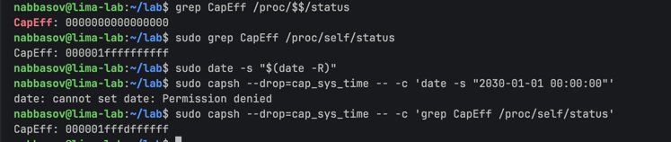

Процесс по-прежнему от uid 0, но время поменять не может.
Ядро при clock_settime() проверяет не uid, а конкретный бит CAP_SYS_TIME — а его нет.
Маска изменилась ровно на один бит: 1ffffffffff против 1fffdffffff, это 25-й бит, тот самый cap_sys_time.

### Seccomp: фильтр на системные вызовы

Профиль руками не пишу, использую systemd — он умеет навешивать фильтр на запускаемый процесс.
Запрещаю безобидный и легко проверяемый вызов — создание каталога:

```
sudo systemd-run --pty -p SystemCallFilter='~mkdir mkdirat' -p SystemCallErrorNumber=EPERM bash
```

Тильда значит «всё разрешить, эти два запретить» (mkdir и mkdirat — старый и новый варианты одного вызова,
утилита mkdir зовёт второй). SystemCallErrorNumber=EPERM велит отвечать на запрещённый вызов ошибкой —
без него ядро по умолчанию убивает процесс сигналом SIGSYS.
Фильтр вешается до запуска, снять его изнутри нельзя, и он наследуется всеми потомками шелла.

Внутри — шелл от root, все capabilities на месте:

```
root@lima-lab:/# mkdir /tmp/blocked
mkdir: Permission denied
root@lima-lab:/# touch /tmp/works && ls /tmp/works
/tmp/works
root@lima-lab:/# grep Seccomp /proc/self/status
Seccomp:        2
Seccomp_filters:        2
```

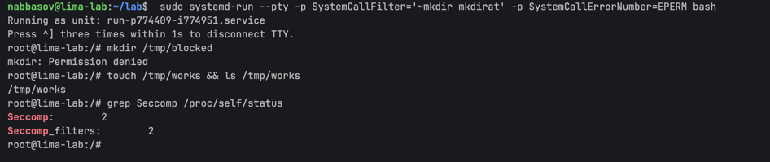

mkdir не прошёл, хотя его делает root со всеми правами: фильтр смотрит только на номер вызова,
до проверки capabilities дело даже не доходит.
touch сработал — он создаёт файл через другие вызовы (openat), их в списке нет.
Seccomp: 2 — режим «filter».

### Вывод шага

Права оказались двумя разными слоями.
Capabilities — крупная нарезка: root сумма из 41 бита,
и ядро на привилегированном действии проверяет конкретный бит, а не uid.
Выкинул один бит — и root больше не может менять время, хотя остальное ему можно.
Seccomp — мелкое сито уровнем ниже: список номеров системных вызовов,
BPF-фильтр на входе в ядро. Ему всё равно, кто зовёт и с какими правами —
запрещённый номер отбивается до всяких проверок capabilities.

## Шаг 5. Собираю всё в mydocker.sh

Теперь все куски из шагов 2–4 складываю в один скрипт: одна команда — и api поднимается
в namespaces, под лимитами cgroup и с урезанными правами.

```bash
#!/bin/bash
set -e

CG=/sys/fs/cgroup/mydocker

mkdir -p $CG
echo "+memory +cpu +pids" > /sys/fs/cgroup/cgroup.subtree_control
echo 256M > $CG/memory.max
echo 0 > $CG/memory.swap.max
echo "50000 100000" > $CG/cpu.max
echo 30 > $CG/pids.max

echo $$ > $CG/cgroup.procs

exec capsh --drop=cap_sys_time -- -c '
  unshare --pid --fork --mount --mount-proc --net --uts --ipc \
    bash -c "hostname mycontainer; ip link set lo up; exec /home/nabbasov.linux/lab/api"
'
```

Запуск и проверки из второго терминала:

```
sudo ~/lab/mydocker.sh
2026/09/26 12:54:10 api listening on :8080

nabbasov@lima-lab:~/lab$ ps aux | grep '[a]pi'
root      774454  ... unshare --pid --fork --mount --mount-proc --net --uts --ipc bash -c ...
root      774456  ... /home/nabbasov.linux/lab/api
nabbasov@lima-lab:~/lab$ cat /proc/774456/cgroup
0::/mydocker
nabbasov@lima-lab:~/lab$ grep CapEff /proc/774456/status
CapEff: 000001fffdffffff
nabbasov@lima-lab:~/lab$ curl localhost:8080/health
curl: (7) Failed to connect to localhost port 8080 after 1 ms: Could not connect to server
```

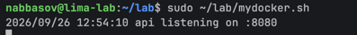

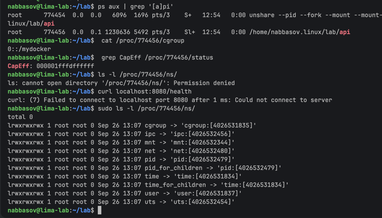

api в группе mydocker, маска CapEff без 25-го бита (cap_sys_time),
curl с хоста не проходит — сеть контейнера пустая, это ожидаемо, veth я не строил.
В sudo ls -l /proc/774456/ns/ пять namespaces новые (pid, mnt, net, uts, ipc),
а user — хостовый
### Вывод шага

Мой скрипт делает три вещи: namespaces (видимость), cgroups (ресурсы), урезание прав.
Это скелет контейнера, и docker run делает ровно то же самое, только руками рантайма.

## Шаг 6. Образы

### Наивный Dockerfile

Пока что я гонял голый бинарник по хостовой файловой системе — настоящему контейнеру нужен образ.
Ставлю docker.io в VM, кладу исходники api в ~/lab/src и пишу Dockerfile в лоб:

```dockerfile
FROM golang:1.22
WORKDIR /src
COPY . .
RUN go build -o /api .
CMD ["/api"]
```

Сборка: docker build -t api:fat . Каждый Step в логе рождает слой с хэшем,
а RUN выполняется в промежуточном контейнере (Running in ... / Removed intermediate container) —
сборка образа это «запустил контейнер, выполнил команду, сфотографировал результат в слой».

```
docker images api:fat
IMAGE     ID             DISK USAGE   CONTENT SIZE
api:fat   e849a95e14c8        1.3GB          308MB
```

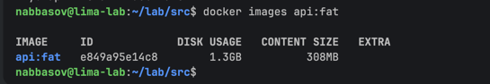

Бинарник весит ~10 МБ, образ — 1.3 ГБ, в сто с лишним раз больше.
Причина: FROM golang:1.22 это не «компилятор на время сборки», а целый Debian с Go toolchain,
и всё это поехало бы в продакшен. CONTENT SIZE 308MB — сжатый вид, сколько ехало бы по сети из registry.

### Кэш слоёв

Повторный docker build отработал за секунду: на каждом шаге Using cache.
Docker сверяет вход шага (для COPY — хэш файлов, для RUN — текст команды и родительский слой)
и переиспользует готовые слои. Кэш ломается не «весь или ничего», а с точки изменения и вниз:
когда я добавил в каталог Dockerfile.scratch, слой COPY . . пересобрался и потянул за собой go build,
хотя сам код не менялся — контекст сборки другой, хэш другой. При этом FROM и WORKDIR остались из кэша.
Отсюда правило: редко меняющееся — наверх Dockerfile, часто меняющееся — вниз.

### Запуск и проброс порта

```
docker run -d --name api-fat -p 8080:8080 api:fat
curl localhost:8080/health
ok
```

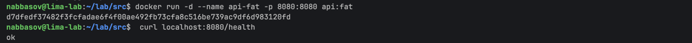

То, чего не умел мой mydocker.sh: изоляция та же (свой net namespace),
но docker достроил к ней veth-пару и проброс, и хостовый порт 8080 ведёт внутрь контейнера.

### Multi-stage на scratch

Компилятор нужен на минуту сборки, но не в продакшене. Dockerfile.scratch — два FROM в одном файле:
первый этап собирает, второй забирает только результат. Основа второго — scratch, пустой образ:

```dockerfile
FROM golang:1.22 AS build
WORKDIR /src
COPY . .
RUN CGO_ENABLED=0 go build -o /api .

FROM scratch
COPY --from=build /api /api
CMD ["/api"]
```
CGO_ENABLED=0 обязателен: в scratch нет libc, динамически слинкованный бинарник
на старте не нашёл бы библиотеки и умер. Статический самодостаточен, ему от ФС не нужно ничего.

```
docker images | grep api
api:fat       e849a95e14c8        1.3GB          308MB
api:slim      b0423e1b70c1       10.5MB         3.79MB
```

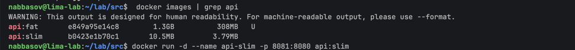

1.3 ГБ против 10.5 МБ — в 124 раза меньше, по сети поедет 3.79 МБ вместо 308.
Сервис работает так же: docker run -d --name api-slim -p 8081:8080 api:slim, curl отвечает ok

Обратная сторона пустоты:

```
docker exec -it api-slim sh
OCI runtime exec failed: ... exec: "sh": executable file not found in $PATH
```

В образе нет шелла, потому что нет ничего, кроме бинарника.
Атакующему, попавшему в контейнер, нечем работать — но и мне нечем дебажить.

### Записываемый слой против тома

Слои образа только для чтения, поверх них у контейнера свой записываемый слой. Проверяю его судьбу:

```
docker exec api-fat bash -c 'echo privet > /data.txt; cat /data.txt'
privet
docker rm -f api-fat
docker run -d --name api-fat -p 8080:8080 api:fat
docker exec api-fat cat /data.txt
cat: /data.txt: No such file or directory
```

Файл умер вместе с контейнером: записываемый слой принадлежит контейнеру,
docker rm удаляет их вместе, новый контейнер начинает с чистого слоя.
Именно в этот момент файл и перестал существовать физически.

Теперь то же самое, но /data — именованный том:

```
docker volume create labdata
docker run -d --name api-fat -p 8080:8080 -v labdata:/data api:fat
docker exec api-fat bash -c 'echo privet > /data/f.txt'
docker rm -f api-fat
docker run -d --name api-fat -p 8080:8080 -v labdata:/data api:fat
docker exec api-fat cat /data/f.txt
privet
```

Том пережил пересоздание: это каталог на хосте (/var/lib/docker/volumes/labdata/...),
который монтируется поверх ФС контейнера. Он не входит в слои, docker rm его не трогает.
Поэтому базы данных в контейнерах всегда пишут в тома.

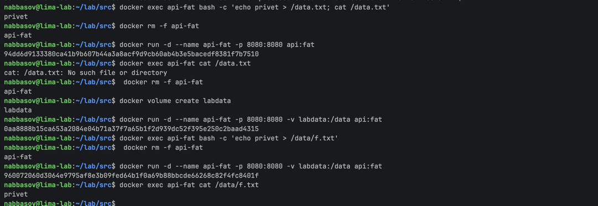

### Вывод шага

Образ — это стопка слоёв только для чтения плюс инструкция запуска.
Слои дают кэ и дешёвое хранение.
Multi-stage отделяет цех от витрины: компилятор остаётся в build-этапе,
в прод едет один статический бинарник на пустом scratch — в 124 раза меньше и почти без поверхности атаки.
Контейнер эфемерен: его записываемый слой умирает по docker rm,
всё ценное должно жить в томе.

## Шаг 7. gVisor: двигаю границу изоляции

Как ни изолируй обычный контейнер, ядро у него общее с хостом: каждый syscall бьёт прямо
в ядро VM, и уязвимость ядра пробивает все namespaces разом. gVisor вставляет прослойку —
Sentry, «ядро в userspace»: приложение думает, что говорит с Linux, а на деле его вызовы
перехватывает Sentry и обслуживает сам.

Ставлю runsc из репозитория gVisor, подключаю к docker (runsc — обычный OCI-рантайм,
взаимозаменяемый с runc):

```
sudo apt-get install -y runsc
sudo runsc install
sudo systemctl restart docker
```

Проверяю, чьё ядро видно из контейнеров:

```
nabbasov@lima-lab:~/lab$ uname -r
7.0.0-28-generic
nabbasov@lima-lab:~/lab$ docker run --rm alpine uname -r
7.0.0-28-generic
nabbasov@lima-lab:~/lab$ docker run --rm --runtime=runsc alpine uname -r
4.19.0-gvisor
```

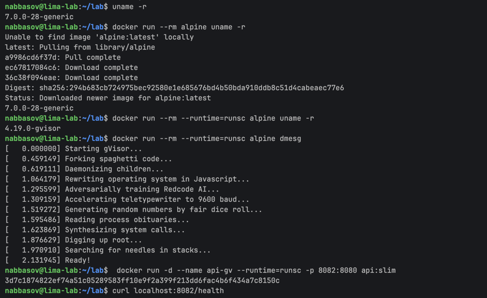

Обычный контейнер честно показал ядро VM — своя ФС, свой дистрибутив, а ядро общее.
Под gVisor на uname ответило не ядро хоста, а Sentry, притворяющийся Linux 4.19 —
до настоящего ядра вызов вообще не дошёл. dmesg под runsc выдаёт полностью выдуманный
«журнал ядра»
И главное — мой api:slim переехал под gVisor без единого изменения:

```
docker run -d --name api-gv --runtime=runsc -p 8082:8080 api:slim
curl localhost:8082/health
ok
```

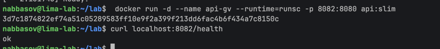

### Вывод шага

Ответ на вопрос лабы «что у контейнера всегда общее с хостом» — ядро.
Образ, ФС, сеть, процессы — всё своё, а ядро одно на всех, в этом и слабость.
gVisor двигает границу: syscall'ы приложения умирают в Sentry,
настоящее ядро видит только узкий набор вызовов от самого Sentry,
и эксплойт ядра из контейнера становится сильно труднее.
Цена: каждый syscall обрабатывается в userspace вместо прямого входа в ядро (медленнее),
и Sentry реализует не все ~450 вызовов Linux — чего нет, то не работает.
Обычный контейнер — скорость, gVisor — недоверенный код, полная VM — максимальная изоляция.

## Шаг 8. Мониторинг

### docker run пишет те же файлы

Секрет мониторинга контейнеров простой: все метрики уже лежат в /sys/fs/cgroup,
я их читал руками в Шаге 3. Проверяю: пересоздаю api-fat с лимитами через флаги docker

```
docker run -d --name api-fat --memory=256m --cpus=0.5 --pids-limit=30 -p 8080:8080 api:fat
ID=$(docker inspect -f '{{.Id}}' api-fat)
cat /sys/fs/cgroup/system.slice/docker-$ID.scope/memory.max
268435456
cat /sys/fs/cgroup/system.slice/docker-$ID.scope/cpu.max
50000 100000
cat /sys/fs/cgroup/system.slice/docker-$ID.scope/pids.max
30
```

268435456 — это 256M в байтах, а cpu.max совпал байт в байт со строкой,
которую я в Шаге 3 писал echo'м в свою группу. --memory/--cpus/--pids-limit —
просто генератор тех же записей в те же файлы, docker на каждый контейнер
заводит такую же cgroup, какую я делал руками.

docker stats — те же файлы, причёсанные в табличку. После curl 'localhost:8080/eat?mb=100'
MEM USAGE вырос с 3.3MiB до 104.5MiB (это memory.current), PIDS с 6 до 7 (go добавил поток).
Занятно, что у api-gv PIDS = 33 против 6 у обычного — потоки Sentry живут в той же cgroup
и тоже считаются.

### cAdvisor

Руками читать файлы для каждого контейнера никто не будет, ставлю cAdvisor —
он опрашивает cgroup всех контейнеров и рисует историю. С свежим docker 29 он
подружился не сразу: сначала его встроенный docker-клиент оказался слишком стар
(API 1.41 при минимуме 1.44), а после обновления до v0.52.1 он не смог найти
записываемый слой контейнеров — искал его в /var/lib/docker/image/overlayfs/...,
а мой docker работает через containerd-snapshotter, и слоями теперь управляет
containerd, старого каталога нет. Из-за этого docker-фабрика cAdvisor падала
и не отдавала cgroup'ы контейнеров универсальной raw-фабрике.

Лечение вышло контринтуитивное — отобрать у мониторинга доступ к docker:

```
docker run -d --name cadvisor -p 8085:8080 \
  -v /:/rootfs:ro \
  -v /sys:/sys:ro \
  gcr.io/cadvisor/cadvisor:v0.52.1
```

Без docker.sock docker-фабрика не регистрируется, и docker-*.scope достаются
raw-фабрике, которой хватает голых cgroup-файлов. Имена контейнеров пропали
(страницы называются docker-<id>.scope), зато графики полноценные. Это лишний раз
доказывает, где на самом деле живут метрики: docker для них не нужен вообще.

Запустил curl 'localhost:8080/burn?sec=120' и открыл страницу контейнера:
Total Usage у api-fat — ровная полка на ~0.5 ядра. /burn просит целое ядро,
но cpu.max 50000/100000 отдаёт полсекунды процессорного времени в секунду,
остальное — троттлинг. Дашборд показывает ровно то, что я в Шаге 3 видел
в cpu.stat как растущий nr_throttled.

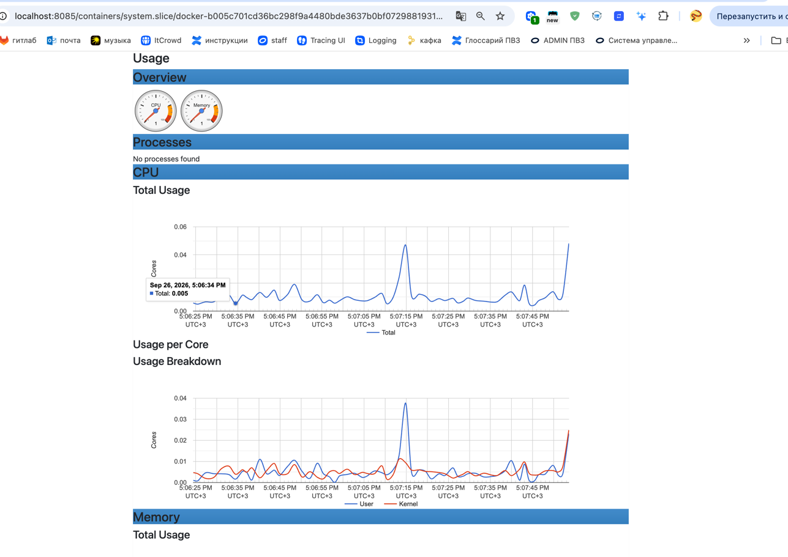

### Три метрики под алерты

1. **memory.current / memory.max выше ~90%.** Предвестник OOM: память подошла
   к лимиту. Просплю — OOM killer убьёт процесс, для пользователей это упавший
   сервис и потерянные запросы. Алерт на сам oom_kill из memory.events тоже нужен,
   но он срабатывает уже по трупу.
2. **nr_throttled / throttled_usec в cpu.stat растут.** Самый коварный случай:
   контейнер жив, health-чеки зелёные, а планировщик его придушил — латенси растёт,
   и никакая другая метрика этого не покажет. Просплю — пользователи получат
   тормозящий сервис при формально здоровом контейнере.
3. **pids.current близко к pids.max.** Предвестник отказа fork: у потолка
   clone начнёт возвращать ошибку, приложение не сможет создать поток под новый
   запрос. Просплю — странные ошибки под нагрузкой при живом процессе.

Все три алерта — про приближение к лимиту, а не про факт наказания:
каждое из трёх наказаний я вызывал руками в Шаге 3 и видел, что метрика-предвестник
начинает расти заранее.

### Вывод шага

Мониторинг контейнеров стоит на тех же cgroup-файлах, которые я читал cat'ом:
docker stats, cAdvisor и любой прод-стек только собирают их для всех контейнеров
сразу и хранят историю. Лимит и метрика — две стороны одного файла:
где я в Шаге 3 ставил ограничение, там же теперь смотрю, насколько к нему подошли.


