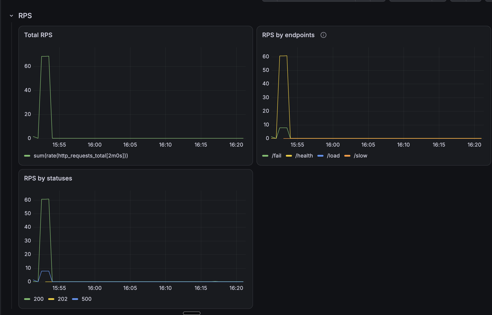
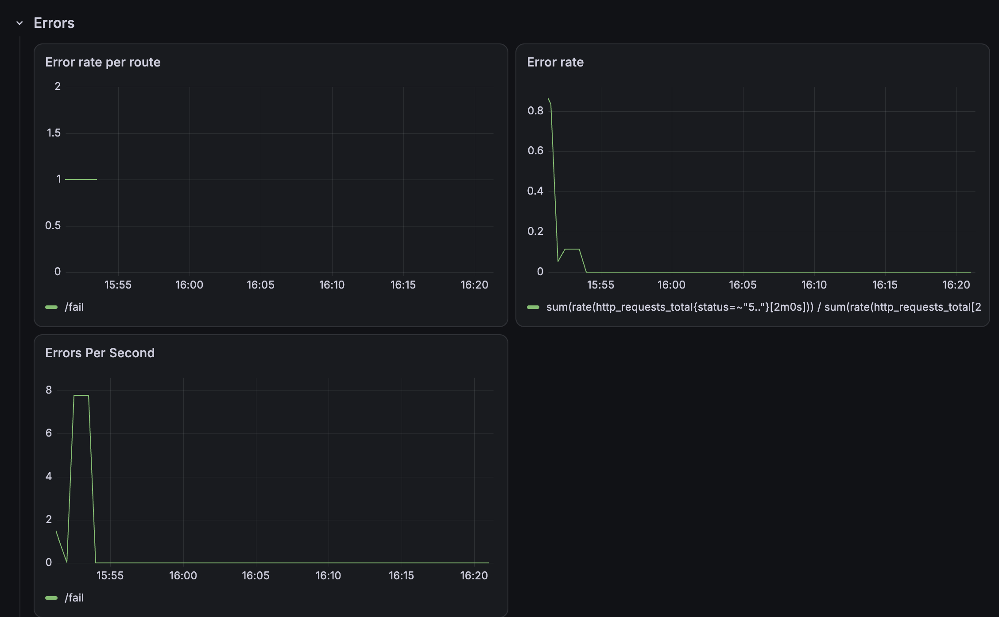
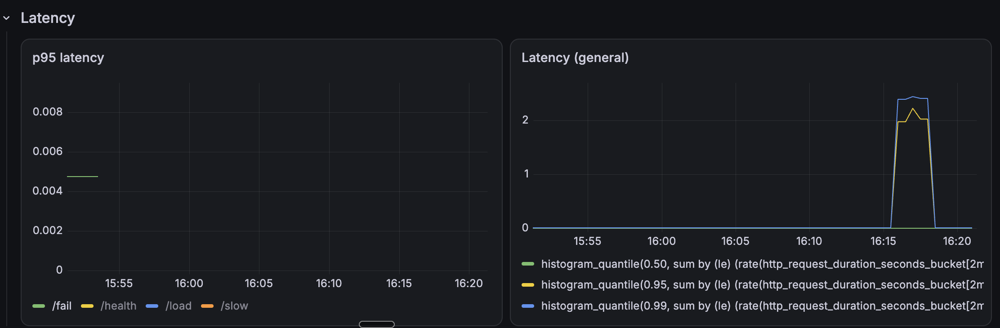
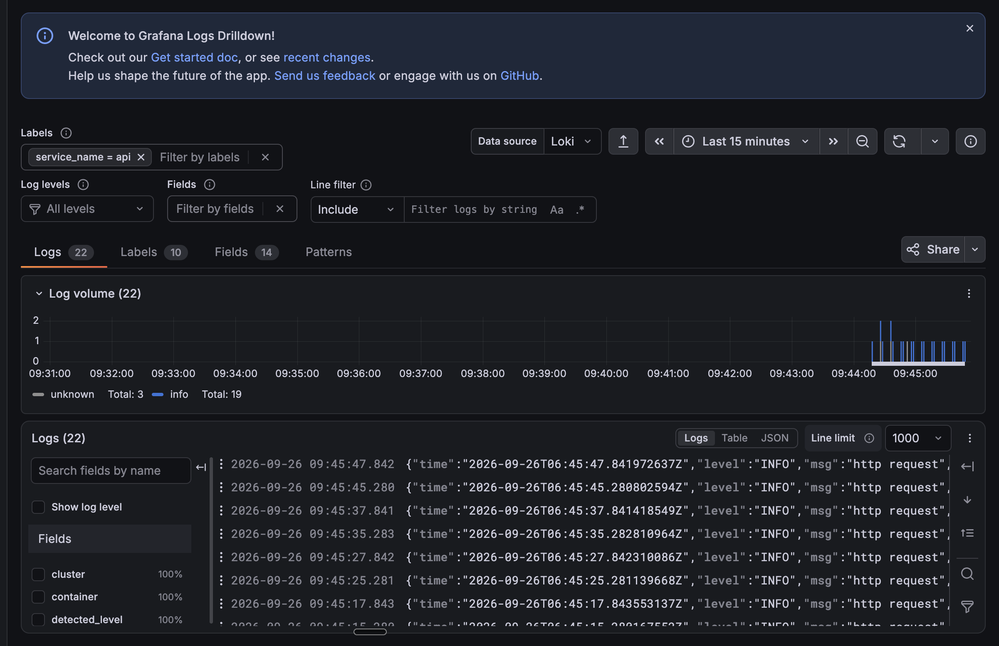
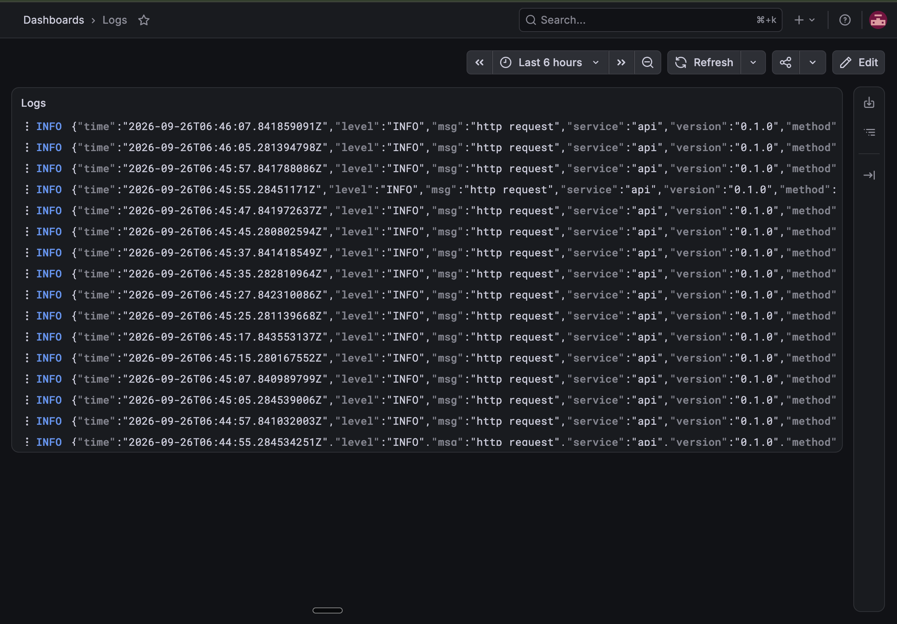
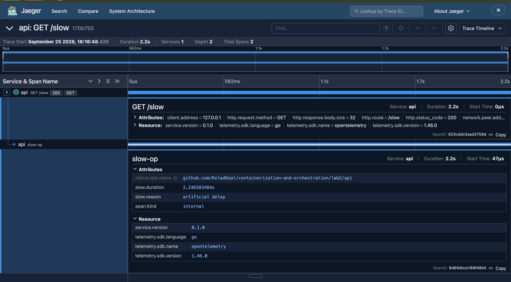
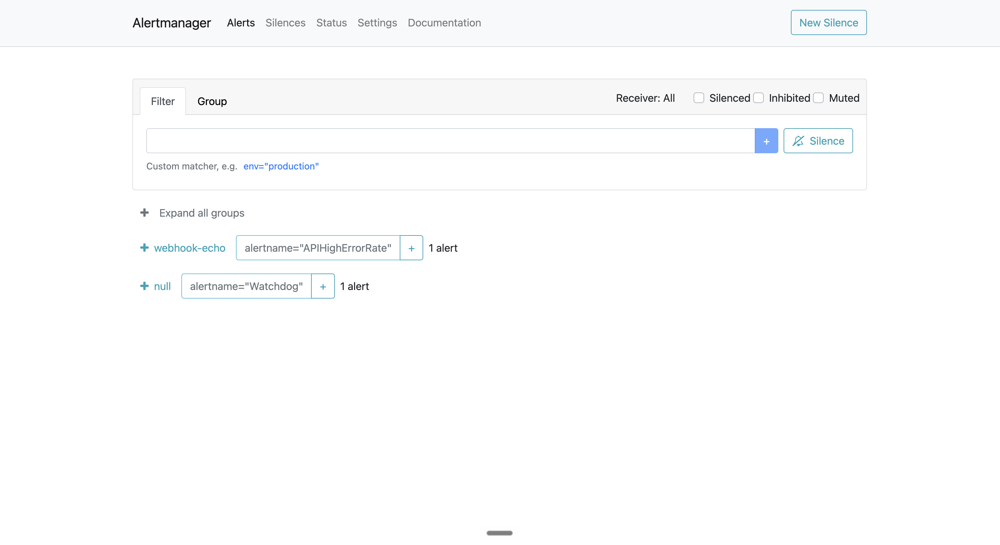
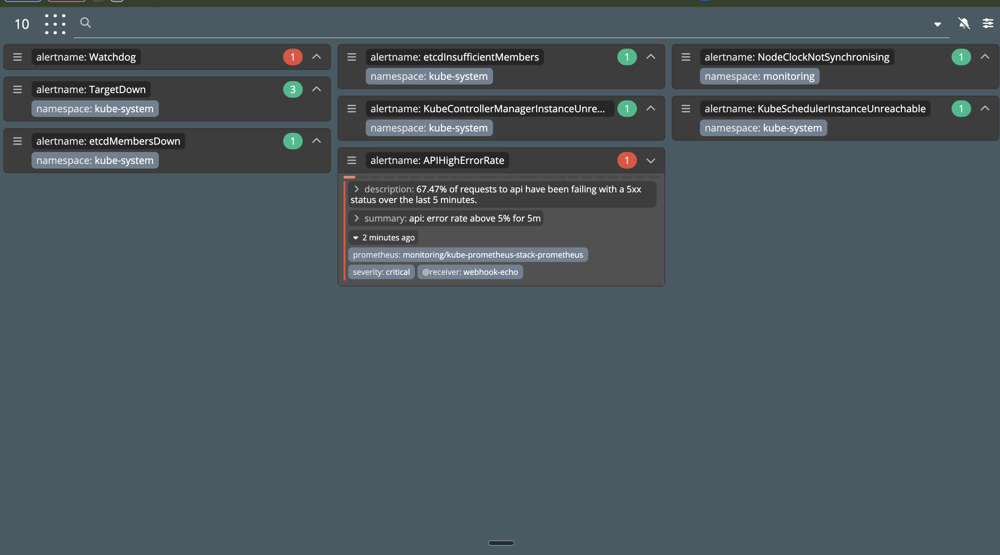
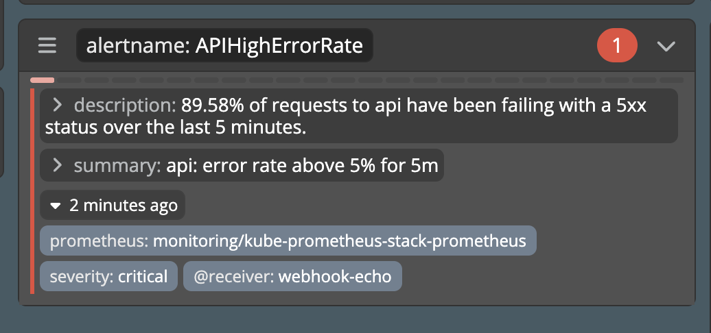

# Лабораторная работа 2 — мониторинг сервиса: метрики, логи, трейсы

Выполнял лабораторную в локальном кластере `minikube`. Использовал 2 неймспейса:
- `default` - в нем развернут `api`. 
- `monitoring` - в нем развернут `kube-prometheus-stack`, `loki`, `alloy`, `jaeger`, а также алертинг.

## Часть 0

С помощью ИИ-агента реализовал сервис на Go и Dockerfile в нему. У сервиса есть все необходимые эндпоинты из описания (`/heath`, `/fail`, `/slow`, `/fail`, `/metrics`).

Также как и требовало описание зарегистрировал метрики RED:

- `http_requests_total{method,route,status}` — общее количество запросов.
- `http_request_errors_total{method,route}` — общее количество 5xx запросов.
- `http_request_duration_seconds` — гистограмма с бакетами.
- `http_requests_in_flight` — gauge текущей конкурентности.

Помимо метрик реализовал логирование внутри сервиса в stdout через стандартную библиотеку языка.

Подключил tracer через OTEL и jaeger. Реализовал под по внедрению `trace_id` и `span_id` в контекст.

## Часть 1

Внурь кластера в `monitoring` установал `kube-prometheus-stack`. Подключил Prometheus к сервису через `ServiceMonitor`. Prometheus с помощью него знает, откуда нужно собират метрики.

Дашборд в Grafana разделил на 3 секции:

- RPS 

- Ошибки

- Latency

## Часть 2

Loki развернут в режиме SingleBinary с filesystem-хранилищем. Выбрал такой режим из-за простоты. 

Отдельно установил агента Alloy как сущность DaemonSet. Так как схема частично похожа с Prometheus (есть централизованное хранилище + агент, собирающий логи).  

Loki подключен к Grafana как дополнительный data source. За счет этого можно смотреть логи и метрики в едином месте.

- Drilldown в Grafana

- Dashboard со всеми логами

## Часть 3

Сервис подключен к OpenTelemetry:
- создается корневой span на каждый входящий запрос.
- идет экспорт по gRPC на `OTEL_EXPORTER_OTLP_ENDPOINT`.

Трейс `/slow`: 

## Часть 4

Три правила описаны в `PrometheusRule`. приемник — webhook-эхо-сервис в кластере.

Алерты:
- `APIHighErrorRate` - доля 5xx > 5% в течение 5 мин. Нужно посмотреть в Grafana, на каком маршруте растут ошибки, взять `trace_id` из лога и открыть трейс в Jaeger.

- `APIHighLatencyP95` - p95 > 1.5 с в течение 5 мин. Нужно найти в Jaeger трейс долгого запроса и посмотреть, какой вложенный span съел время.

- `APIDown` - `up{job="api"} == 0` в течение 2 мин. Нужно выполнить `kubectl get pods` / события / логи предыдущего контейнера, проверить лимиты памяти.

Алерт в состоянии firing после прогона `/fail`, Alertmanager сгруппировал его в приемник `webhook-echo`:

Тот же алерт в Karma рядом с системными алертами кластера, с описанием и лейблами:

